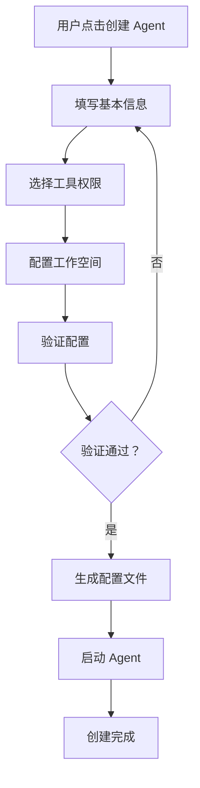
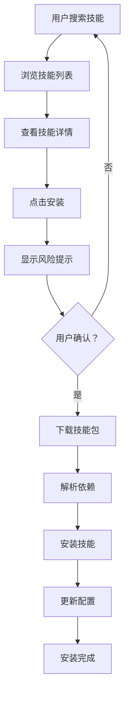
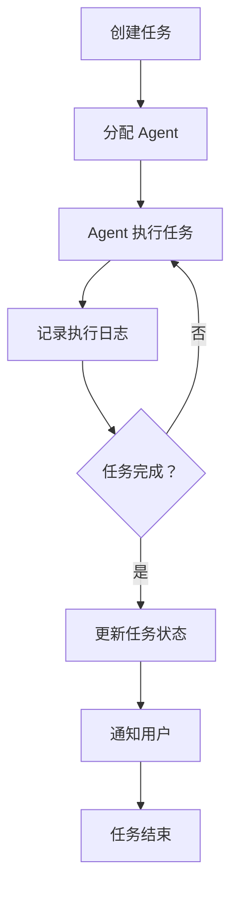
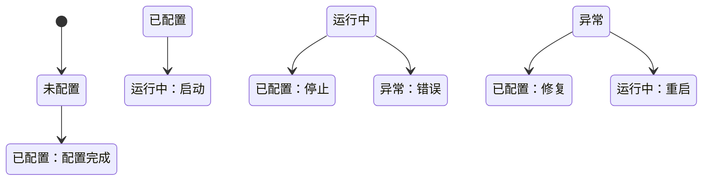
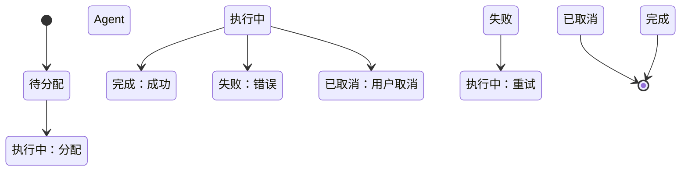

# OpenClaw 可视化管理系统 - 产品需求文档 (PRD)

## 📋 文档信息

| 字段 | 内容 |
|------|------|
| 产品名称 | OpenClaw Dashboard |
| 版本 | v1.0 |
| 创建日期 | 2026-03-12 |
| 最后更新 | 2026-03-12 |
| 负责人 | product_manager |

---

## 1. 背景与目标

### 1.1 背景

OpenClaw 是一个强大的 AI 智能体编排框架，支持主协调者 Agent、子 Agent 调度、工具调用、技能系统等核心能力。然而，当前系统主要通过命令行和配置文件进行管理，存在以下痛点：

- **缺乏可视化界面**：用户无法直观查看 Agent 状态、任务进度和系统健康度
- **配置管理复杂**：需要手动编辑多个 Markdown 配置文件，学习成本高
- **监控能力弱**：无法实时追踪子 Agent 执行状态、资源消耗和错误日志
- **技能管理不便**：技能的发现、安装、更新需要通过 CLI 命令完成
- **协作效率低**：团队成员难以共享和同步 Agent 配置与任务状态

### 1.2 目标

构建一个 Web 可视化管理系统，让 OpenClaw 的管理和监控更加直观、高效、易用。

- **目标 1**: 提供直观的 Agent 状态监控面板，实时展示系统运行状态
- **目标 2**: 实现配置文件的可视化编辑，降低使用门槛
- **目标 3**: 提供任务管理和追踪能力，支持任务创建、分配、监控全流程
- **目标 4**: 集成技能市场，支持一键搜索、安装、更新技能
- **目标 5**: 提供日志查看和诊断工具，快速定位问题

### 1.3 成功指标

**核心指标:**
- 用户配置时间减少 50%
- 问题排查时间减少 60%
- 日活跃用户数 > 100（上线 3 个月内）

**辅助指标:**
- 用户满意度评分 > 4.5/5
- 技能安装成功率 > 95%
- 页面加载时间 < 2 秒

---

## 2. 用户画像

### 2.1 目标用户

| 用户类型 | 特征 | 需求 |
|----------|------|------|
| **开发者** | 技术背景强，熟悉命令行，需要深度定制 | 快速配置、日志调试、API 访问 |
| **产品经理** | 业务导向，关注任务流程和结果 | 任务监控、进度追踪、报告生成 |
| **运维人员** | 关注系统稳定性和资源消耗 | 健康监控、告警通知、资源统计 |
| **团队成员** | 需要协作和共享配置 | 配置同步、权限管理、版本控制 |

### 2.2 使用场景

**场景 1: 新用戶快速上手**
> 用户小王刚接触 OpenClaw，需要创建一个产品管理 Agent。他通过 Dashboard 的向导模式，逐步填写 Agent 名称、专长、工具权限等信息，系统自动生成配置文件并启动 Agent。整个过程无需接触命令行。

**场景 2: 任务监控与调试**
> 用户小李发现某个子 Agent 执行缓慢。她打开 Dashboard 的任务监控面板，查看该 Agent 的实时状态、工具调用历史、资源消耗曲线，并通过日志查看器定位到是某个 API 调用超时导致。她及时调整了超时配置。

**场景 3: 技能市场浏览与安装**
> 用户小张需要一个天气查询技能。他在 Dashboard 的技能市场中搜索"weather"，浏览技能详情、用户评价和版本历史，点击"安装"后系统自动完成下载和配置，并显示安装进度。

**场景 4: 团队协作配置同步**
> 用户小赵是团队负责人，他修改了主 Agent 的配置后，通过 Dashboard 的配置版本管理功能提交变更，团队成员可以查看变更历史、对比差异，并选择同步最新配置。

---

## 3. 功能需求

### 3.1 功能列表

| 优先级 | 功能模块 | 功能 | 描述 | 用户价值 |
|--------|----------|------|------|----------|
| P0 | 系统概览 | 状态仪表盘 | 展示系统整体运行状态、Agent 数量、任务统计 | 快速了解系统健康度 |
| P0 | Agent 管理 | Agent 列表与详情 | 查看所有 Agent 状态、配置、工具权限 | 集中管理 Agent |
| P0 | Agent 管理 | Agent 创建/编辑 | 可视化创建和编辑 Agent 配置 | 降低配置门槛 |
| P0 | 任务管理 | 任务列表与追踪 | 查看任务状态、进度、执行日志 | 追踪任务执行 |
| P1 | 配置管理 | 配置文件编辑器 | 在线编辑 Markdown 配置文件 | 无需命令行即可配置 |
| P1 | 配置管理 | 版本历史 | 查看配置变更历史、回滚 | 配置审计与恢复 |
| P1 | 技能市场 | 技能搜索与浏览 | 搜索、浏览技能详情 | 发现所需技能 |
| P1 | 技能市场 | 技能安装/更新 | 一键安装、更新技能 | 简化技能管理 |
| P1 | 日志中心 | 实时日志查看 | 查看 Agent 和任务日志 | 问题诊断 |
| P2 | 监控告警 | 资源监控 | CPU、内存、网络使用率 | 资源规划 |
| P2 | 监控告警 | 告警通知 | 配置告警规则，推送通知 | 主动发现问题 |
| P2 | 用户管理 | 权限控制 | 角色权限管理、操作审计 | 团队协作安全 |
| P2 | 系统设置 | 网关配置 | 配置 Gateway 参数、API 密钥 | 系统级配置 |

### 3.2 功能详情

#### 功能 1: 状态仪表盘

**用户故事:**
> 作为系统管理员，我想要一个直观的状态仪表盘，以便快速了解系统整体健康度和关键指标。

**功能描述:**
- 展示系统运行状态（在线/离线/异常）
- 显示活跃 Agent 数量、任务数量统计
- 展示资源使用率（CPU、内存、存储）
- 显示最近告警和事件列表
- 提供快速操作入口（创建 Agent、查看日志等）

**交互流程:**
```
1. 用户登录 Dashboard
2. 系统自动加载仪表盘页面
3. 用户查看关键指标卡片
4. 用户点击卡片进入详情页面
```

**验收标准:**
- [ ] 页面加载时间 < 2 秒
- [ ] 数据每 30 秒自动刷新
- [ ] 支持手动刷新
- [ ] 关键指标卡片可点击跳转

**边界情况:**
- 网关离线时显示降级状态提示
- 数据加载失败时显示重试按钮

---

#### 功能 2: Agent 管理

**用户故事:**
> 作为用户，我想要可视化管理 Agent，以便快速创建、配置和监控 Agent。

**功能描述:**
- Agent 列表：展示所有 Agent，支持筛选和搜索
- Agent 详情：展示配置、状态、工具权限、任务历史
- Agent 创建：向导模式创建新 Agent
- Agent 编辑：在线编辑 Agent 配置
- Agent 操作：启动、停止、重启 Agent

**交互流程:**
```
1. 用户进入 Agent 管理页面
2. 用户查看 Agent 列表
3. 用户点击 Agent 进入详情页
4. 用户可编辑配置或执行操作
```

**验收标准:**
- [ ] 列表支持按状态、类型筛选
- [ ] 配置编辑支持语法高亮
- [ ] 操作执行后显示结果反馈
- [ ] 支持配置导入/导出

**边界情况:**
- Agent 运行中时禁止删除
- 配置保存前进行语法校验

---

#### 功能 3: 任务管理

**用户故事:**
> 作为用户，我想要追踪任务执行状态，以便了解进度和排查问题。

**功能描述:**
- 任务列表：展示所有任务，支持状态筛选
- 任务详情：展示任务信息、执行日志、子任务状态
- 任务创建：创建新任务并分配给 Agent
- 任务控制：暂停、恢复、取消任务

**交互流程:**
```
1. 用户进入任务管理页面
2. 用户查看任务列表
3. 用户点击任务进入详情页
4. 用户可查看日志或控制任务
```

**验收标准:**
- [ ] 任务状态实时更新
- [ ] 日志支持关键词搜索
- [ ] 支持日志导出
- [ ] 子任务状态可视化展示

**边界情况:**
- 任务超时自动标记为异常
- 日志过大时分页加载

---

#### 功能 4: 技能市场

**用户故事:**
> 作为用户，我想要浏览和安装技能，以便扩展 Agent 能力。

**功能描述:**
- 技能浏览：按分类浏览技能
- 技能搜索：关键词搜索技能
- 技能详情：展示技能描述、版本、依赖、评价
- 技能安装：一键安装技能
- 技能更新：检查并更新已安装技能

**交互流程:**
```
1. 用户进入技能市场页面
2. 用户搜索或浏览技能
3. 用户查看技能详情
4. 用户点击安装/更新
5. 系统显示安装进度
```

**验收标准:**
- [ ] 支持 skillhub 和 clawhub 双源搜索
- [ ] 安装前显示风险提示
- [ ] 安装进度可视化
- [ ] 支持已安装技能列表管理

**边界情况:**
- 网络超时时显示重试选项
- 依赖冲突时显示解决建议

---

#### 功能 5: 配置编辑器

**用户故事:**
> 作为用户，我想要在线编辑配置文件，以便无需命令行即可修改配置。

**功能描述:**
- 文件树：展示工作空间文件结构
- 编辑器：Markdown 语法高亮编辑
- 保存：保存配置到文件
- 验证：配置语法校验
- 对比：变更前后对比

**交互流程:**
```
1. 用户进入配置管理页面
2. 用户选择要编辑的文件
3. 用户在编辑器中修改内容
4. 用户保存并验证配置
```

**验收标准:**
- [ ] 支持 Markdown 语法高亮
- [ ] 保存前自动验证语法
- [ ] 支持版本对比
- [ ] 支持撤销/重做

**边界情况:**
- 文件被占用时提示
- 保存失败时保留本地副本

---

#### 功能 6: 日志中心

**用户故事:**
> 作为用户，我想要查看系统日志，以便诊断问题。

**功能描述:**
- 日志列表：展示日志文件列表
- 日志查看：实时查看日志内容
- 日志搜索：关键词搜索日志
- 日志过滤：按级别、时间过滤
- 日志导出：导出日志文件

**交互流程:**
```
1. 用户进入日志中心
2. 用户选择日志源
3. 用户查看或搜索日志
4. 用户可导出日志
```

**验收标准:**
- [ ] 支持实时日志流
- [ ] 支持多关键词搜索
- [ ] 支持日志级别过滤
- [ ] 导出格式支持 TXT/JSON

**边界情况:**
- 日志文件过大时分页加载
- 实时日志断开时自动重连

---

## 4. 非功能需求

### 4.1 性能要求
- **响应时间**: 页面加载 < 2 秒，API 响应 < 500ms
- **并发量**: 支持 50+ 并发用户
- **数据量**: 支持 1000+ Agent、10000+ 任务记录
- **日志处理**: 支持 100MB+ 日志文件快速加载

### 4.2 安全要求
- **认证**: 支持用户名/密码、API Key 认证
- **授权**: 基于角色的权限控制（RBAC）
- **数据加密**: HTTPS 传输加密，敏感数据存储加密
- **审计**: 记录所有关键操作日志

### 4.3 兼容性要求
- **浏览器**: Chrome 90+、Firefox 88+、Safari 14+、Edge 90+
- **设备**: 桌面端优先，支持平板适配
- **系统**: Linux、macOS、Windows

### 4.4 可用性要求
- **可用性**: 99.9%  uptime
- **可维护性**: 支持热更新，无需停机发布
- **可扩展性**: 模块化设计，支持功能扩展

---

## 5. 业务流程

### 5.1 核心流程

#### Agent 创建流程



#### 技能安装流程



#### 任务执行流程



### 5.2 状态机

#### Agent 状态机



#### 任务状态机



---

## 6. 数据需求

### 6.1 数据模型

#### Agent 实体
```
Agent {
  id: string
  name: string
  type: string (main|subagent)
  status: string (running|stopped|error)
  config: object
  tools: array
  workspace: string
  createdAt: datetime
  updatedAt: datetime
}
```

#### Task 实体
```
Task {
  id: string
  name: string
  description: string
  agentId: string
  status: string (pending|running|completed|failed|cancelled)
  priority: string (low|medium|high)
  params: object
  result: object
  logs: array
  createdAt: datetime
  startedAt: datetime
  completedAt: datetime
}
```

#### Skill 实体
```
Skill {
  id: string
  name: string
  version: string
  description: string
  author: string
  source: string (skillhub|clawhub|local)
  installed: boolean
  installedVersion: string
  dependencies: array
  createdAt: datetime
  updatedAt: datetime
}
```

#### Config 实体
```
Config {
  id: string
  path: string
  content: string
  version: number
  author: string
  changeLog: string
  createdAt: datetime
}
```

### 6.2 埋点需求

| 事件 | 触发条件 | 参数 |
|------|----------|------|
| page_view | 页面访问 | page_name, user_id |
| agent_create | 创建 Agent | agent_type, tools_count |
| agent_start | 启动 Agent | agent_id |
| agent_stop | 停止 Agent | agent_id |
| task_create | 创建任务 | task_type, agent_id |
| task_complete | 任务完成 | task_id, duration |
| skill_install | 安装技能 | skill_name, source |
| config_save | 保存配置 | file_path, change_size |
| error_occurred | 发生错误 | error_type, error_message |

---

## 7. 风险与依赖

### 7.1 技术风险
- **风险 1**: OpenClaw API 变更可能导致 Dashboard 不兼容
  - 缓解：建立 API 版本兼容层，定期同步上游变更
- **风险 2**: 实时日志处理可能影响性能
  - 缓解：采用流式处理，限制单文件大小
- **风险 3**: 配置文件编辑可能导致语法错误
  - 缓解：保存前强制验证，提供回滚能力

### 7.2 业务风险
- **风险 1**: 用户接受度低，仍习惯命令行
  - 缓解：提供 CLI 与 Dashboard 对照文档，突出效率提升
- **风险 2**: 团队协作需求不足
  - 缓解：优先满足个人用户，逐步扩展团队功能

### 7.3 外部依赖
- **OpenClaw Gateway**: Dashboard 依赖 Gateway 提供 API
- **技能注册表**: skillhub/clawhub 服务可用性
- **浏览器兼容性**: 需要支持主流浏览器

---

## 8. 上线计划

### 8.1 里程碑

| 阶段 | 时间 | 交付物 |
|------|------|--------|
| 需求评审 | 第 1 周 | PRD 定稿、UI 设计稿 |
| 技术设计 | 第 2 周 | 架构设计、API 定义 |
| 核心开发 | 第 3-6 周 | 仪表盘、Agent 管理、任务管理 |
| 功能完善 | 第 7-8 周 | 技能市场、配置编辑、日志中心 |
| 测试验收 | 第 9 周 | 测试报告、Bug 修复 |
| 灰度发布 | 第 10 周 | 小范围用户试用 |
| 全量发布 | 第 11 周 | 正式上线 |

### 8.2 发布策略
- [x] 灰度发布：先面向内部团队和核心用户
- [ ] A/B 测试：对比新旧配置方式效率
- [ ] 全量发布：开放给所有用户

---

## 9. 附录

### 9.1 界面草图描述

#### 9.1.1 仪表盘页面
```
┌─────────────────────────────────────────────────────────────┐
│  OpenClaw Dashboard                              [用户] [设置] │
├─────────────────────────────────────────────────────────────┤
│  📊 系统概览                                                 │
│  ┌──────────┐ ┌──────────┐ ┌──────────┐ ┌──────────┐       │
│  │ Agent    │ │ 任务     │ │ 技能     │ │ 系统状态 │       │
│  │   12     │ │   45     │ │   28     │ │  🟢 正常  │       │
│  │  ↑ 3     │ │  8 执行中 │ │  5 可更新 │ │  运行 15d  │       │
│  └──────────┘ └──────────┘ └──────────┘ └──────────┘       │
│                                                              │
│  📈 资源使用率                                                │
│  ┌──────────────────────────────────────────────────────┐   │
│  │ CPU: ████████░░ 80%   内存：████░░░░░░ 40%          │   │
│  └──────────────────────────────────────────────────────┘   │
│                                                              │
│  ⚠️ 最近告警                                                 │
│  • [10:23] Agent-3 内存使用超过阈值                          │
│  • [09:15] 任务 Task-123 执行超时                            │
│                                                              │
│  🚀 快速操作                                                 │
│  [创建 Agent] [查看日志] [技能市场] [系统设置]               │
└─────────────────────────────────────────────────────────────┘
```

#### 9.1.2 Agent 管理页面
```
┌─────────────────────────────────────────────────────────────┐
│  Agent 管理                              [+ 创建 Agent] [刷新] │
├─────────────────────────────────────────────────────────────┤
│  筛选：[全部 ▼] [类型 ▼] [状态 ▼]     搜索：[🔍          ]  │
├─────────────────────────────────────────────────────────────┤
│  名称          │ 类型 │ 状态   │ 工具数 │ 任务 │ 操作      │
│  ─────────────────────────────────────────────────────────  │
│  main          │ 主协调│ 🟢 运行 │   8    │  12  │ [详情]   │
│  product_mgr   │ 子 Agent│ 🟢 运行 │   5    │   5  │ [详情]   │
│  coder         │ 子 Agent│ 🟡 停止 │   6    │   8  │ [详情]   │
│  ...                                                        │
└─────────────────────────────────────────────────────────────┘
```

#### 9.1.3 技能市场页面
```
┌─────────────────────────────────────────────────────────────┐
│  技能市场                                [源：skillhub ▼]    │
├─────────────────────────────────────────────────────────────┤
│  搜索：[🔍 搜索技能...]     分类：[全部 ▼] [排序：热门 ▼]   │
├─────────────────────────────────────────────────────────────┤
│  ┌─────────────────┐ ┌─────────────────┐ ┌─────────────────┐│
│  │ 🌤️ weather      │ │ 📊 mermaid      │ │ 🔧 github-mcp   ││
│  │ 天气查询技能    │ │ Mermaid 图表    │ │ GitHub 集成     ││
│  │ ⭐ 4.8 (128)   │ │ ⭐ 4.6 (89)    │ │ ⭐ 4.9 (256)   ││
│  │ v1.2.3         │ │ v2.0.1         │ │ v1.5.0         ││
│  │ [安装]         │ │ [已安装] [更新]│ │ [已安装]       ││
│  └─────────────────┘ └─────────────────┘ └─────────────────┘│
│  ...                                                        │
└─────────────────────────────────────────────────────────────┘
```

#### 9.1.4 配置编辑器页面
```
┌─────────────────────────────────────────────────────────────┐
│  配置编辑器                           [保存] [验证] [历史]   │
├─────────────────────────────────────────────────────────────┤
│  📁 文件树            │  📝 AGENTS.md                        │
│  ├─ agents/          │  # AGENTS.md - 主协调者...            │
│  │  ├─ main/         │                                      │
│  │  └─ product_mgr/  │  ## 🎯 你的角色                       │
│  ├─ products/        │  你是**主协调者 Agent (main)**...     │
│  ├─ projects/        │                                      │
│  └─ skills/          │  ## 核心能力                          │
│                       │  ...                                 │
│                       │                                      │
│                       │  [语法校验通过 ✓]                    │
└─────────────────────────────────────────────────────────────┘
```

#### 9.1.5 日志中心页面
```
┌─────────────────────────────────────────────────────────────┐
│  日志中心                              [导出] [自动滚动 ⚪]   │
├─────────────────────────────────────────────────────────────┤
│  源：[main-agent ▼]  级别：[全部 ▼]  搜索：[🔍          ]   │
├─────────────────────────────────────────────────────────────┤
│  2026-03-12 23:39:15 [INFO] Agent main started successfully │
│  2026-03-12 23:39:16 [INFO] Loading tools configuration...   │
│  2026-03-12 23:39:17 [WARN] Tool web_search needs API key   │
│  2026-03-12 23:39:18 [INFO] Subagent d95a4e37 created       │
│  2026-03-12 23:39:20 [ERROR] Failed to fetch URL: timeout   │
│  2026-03-12 23:39:21 [INFO] Task completed in 5.2s          │
│  ...                                                        │
│                                                              │
│  [1] [2] [3] ... [10]                          共 1234 条   │
└─────────────────────────────────────────────────────────────┘
```

### 9.2 术语表

| 术语 | 解释 |
|------|------|
| Agent | AI 智能体，可独立或协作完成任务 |
| Gateway | OpenClaw 网关服务，提供 API 和工具调用能力 |
| Subagent | 子智能体，由主 Agent 创建和协调 |
| Skill | 技能包，扩展 Agent 能力的模块 |
| Tool | 工具，Agent 可调用的外部能力（如文件读写、浏览器控制等） |
| Workspace | 工作空间，Agent 的文件操作根目录 |
| Session | 会话，Agent 与用户的一次交互上下文 |

### 9.3 技术栈建议

| 层级 | 技术选型 | 理由 |
|------|----------|------|
| 前端框架 | React 18 + TypeScript | 生态成熟，类型安全 |
| UI 组件库 | Ant Design / MUI | 组件丰富，文档完善 |
| 状态管理 | Zustand / Redux Toolkit | 轻量易用 |
| 图表库 | ECharts / Recharts | 功能强大，性能好 |
| 后端框架 | Node.js + Express / Fastify | 与 OpenClaw 技术栈一致 |
| API 风格 | RESTful + WebSocket | 简单直观，支持实时通信 |
| 数据库 | SQLite (轻量) / PostgreSQL (生产) | 根据部署规模选择 |
| 认证 | JWT + Session | 简单安全 |
| 部署 | Docker + Nginx | 标准化，易扩展 |

### 9.4 API 设计建议

#### 核心 API 端点

```
# Agent 管理
GET    /api/agents              # 获取 Agent 列表
GET    /api/agents/:id          # 获取 Agent 详情
POST   /api/agents              # 创建 Agent
PUT    /api/agents/:id          # 更新 Agent
DELETE /api/agents/:id          # 删除 Agent
POST   /api/agents/:id/start    # 启动 Agent
POST   /api/agents/:id/stop     # 停止 Agent

# 任务管理
GET    /api/tasks               # 获取任务列表
GET    /api/tasks/:id           # 获取任务详情
POST   /api/tasks               # 创建任务
POST   /api/tasks/:id/cancel    # 取消任务

# 技能市场
GET    /api/skills              # 搜索技能
GET    /api/skills/:name        # 获取技能详情
POST   /api/skills/:name/install # 安装技能
POST   /api/skills/:name/update  # 更新技能
DELETE /api/skills/:name        # 卸载技能

# 配置管理
GET    /api/config/files        # 获取文件列表
GET    /api/config/files/*path  # 获取文件内容
PUT    /api/config/files/*path  # 更新文件内容
GET    /api/config/history/*path # 获取版本历史

# 日志中心
GET    /api/logs                # 获取日志列表
GET    /api/logs/stream         # 实时日志流 (WebSocket)
GET    /api/logs/*path          # 获取日志内容

# 系统监控
GET    /api/system/status       # 系统状态
GET    /api/system/resources    # 资源使用率
GET    /api/system/health       # 健康检查
```

---

_文档结束_

**创建时间**: 2026-03-12  
**版本**: v1.0  
**状态**: 待评审
