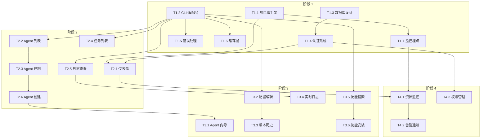

# OpenClaw Dashboard - 项目开发任务排期表

## 📋 项目总览

| 字段 | 内容 |
|------|------|
| **项目名称** | OpenClaw Dashboard |
| **总工期** | 18 周（约 4 个月） |
| **人力配置** | 3-5 人（前端 1-2 人，后端 1-2 人，全栈/DevOps 1 人） |
| **总工作量** | 约 98 人天 |
| **启动日期** | 2026-03-17 |
| **预计上线** | 2026-07-24 |

---

## 🎯 阶段划分

```
┌─────────────────────────────────────────────────────────────────────────────┐
│  阶段 1: 项目准备与基础架构 (第 1-2 周)                                       │
│  ████████░░░░░░░░░░░░░░░░░░░░░░░░░░░░░░░░░░░░░░░░░░░░░░░░░░░░░░░░░░░░░░░░░░│
├─────────────────────────────────────────────────────────────────────────────┤
│  阶段 2: 核心功能开发 - P0 (第 3-6 周)                                        │
│  ░░░░░░░░████████████████░░░░░░░░░░░░░░░░░░░░░░░░░░░░░░░░░░░░░░░░░░░░░░░░░░│
├─────────────────────────────────────────────────────────────────────────────┤
│  阶段 3: 增强功能开发 - P1 (第 7-11 周)                                       │
│  ░░░░░░░░░░░░░░░░░░░░░░░░████████████████████░░░░░░░░░░░░░░░░░░░░░░░░░░░░░░│
├─────────────────────────────────────────────────────────────────────────────┤
│  阶段 4: 高级功能开发 - P2 (第 12-15 周)                                      │
│  ░░░░░░░░░░░░░░░░░░░░░░░░░░░░░░░░░░░░░░░░░░░░████████████████░░░░░░░░░░░░░░│
├─────────────────────────────────────────────────────────────────────────────┤
│  阶段 5: 测试与上线 (第 16-18 周)                                             │
│  ░░░░░░░░░░░░░░░░░░░░░░░░░░░░░░░░░░░░░░░░░░░░░░░░░░░░░░░░░░░░████████░░░░░░│
└─────────────────────────────────────────────────────────────────────────────┘
   第 1 周    第 4 周    第 8 周    第 12 周   第 16 周   第 18 周
```

---

## 📅 详细任务分解

### 阶段 1: 项目准备与基础架构（第 1-2 周）

| 任务 ID | 任务名称 | 任务描述 | 优先级 | 工时 (人天) | 依赖任务 | 负责人 | 开始周 | 结束周 | 交付物 |
|--------|----------|----------|--------|-------------|----------|--------|--------|--------|--------|
| T1.1 | 项目脚手架搭建 | 前后端项目初始化、构建配置、代码规范 | P0 | 3 | 无 | 全栈 | 1 | 1 | 项目骨架、构建脚本 |
| T1.2 | OpenClaw CLI 适配层 | 封装 CLI 命令、输出解析、Schema 校验 | P0 | 3 | 无 | 后端 | 1 | 2 | CLI Adapter 模块 |
| T1.3 | 数据库设计与实现 | SQLite/PostgreSQL 表结构、索引、迁移脚本 | P0 | 2 | 无 | 后端 | 1 | 1 | 数据库 Schema、迁移脚本 |
| T1.4 | 基础认证系统 | JWT 认证、用户登录、权限中间件 | P0 | 2 | T1.3 | 后端 | 1 | 2 | 认证模块、登录页面 |
| T1.5 | 错误处理框架 | 统一错误处理、重试机制、熔断器 | P0 | 2 | T1.2 | 后端 | 2 | 2 | 错误处理模块 |
| T1.6 | 缓存层设计 | 内存缓存/Redis 集成、缓存策略配置 | P1 | 2 | T1.2 | 后端 | 2 | 2 | 缓存服务模块 |
| T1.7 | 监控埋点设计 | Prometheus 集成、关键指标定义 | P1 | 2 | T1.1 | 全栈 | 2 | 2 | 监控配置、指标面板 |

**阶段 1 小计**: 16 人天

---

### 阶段 2: 核心功能开发 - P0（第 3-6 周）

| 任务 ID | 任务名称 | 任务描述 | 优先级 | 工时 (人天) | 依赖任务 | 负责人 | 开始周 | 结束周 | 交付物 |
|--------|----------|----------|--------|-------------|----------|--------|--------|--------|--------|
| T2.1 | 系统状态仪表盘 | 系统概览卡片、资源使用率、快速操作入口 | P0 | 3 | T1.1, T1.4 | 前端 | 3 | 3 | 仪表盘页面 |
| T2.2 | Agent 列表与详情 | Agent 列表展示、筛选搜索、详情查看 | P0 | 3 | T1.2 | 前端 | 3 | 4 | Agent 管理页面 |
| T2.3 | Agent 启动/停止控制 | Agent 操作 API、状态同步、操作反馈 | P0 | 2 | T2.2, T1.2 | 后端 | 3 | 4 | Agent 控制 API |
| T2.4 | 任务列表与状态 | 任务列表、状态筛选、任务详情 | P0 | 3 | T1.2 | 前端 | 4 | 4 | 任务管理页面 |
| T2.5 | 任务日志查看（基础版） | 日志文件读取、分页加载、关键词搜索 | P0 | 3 | T1.2 | 全栈 | 4 | 5 | 日志查看器组件 |
| T2.6 | 基础 Agent 创建 | 简化版 Agent 创建表单、配置文件生成 | P0 | 3 | T2.3 | 全栈 | 5 | 5 | Agent 创建向导 |
| T2.7 | API 文档完善 | Swagger/OpenAPI 文档、接口说明 | P1 | 2 | T2.3, T2.5 | 后端 | 5 | 6 | API 文档 |
| T2.8 | 单元测试编写 | 核心模块单元测试、覆盖率 80%+ | P1 | 4 | T2.1-T2.6 | 全栈 | 5 | 6 | 测试用例、测试报告 |
| T2.9 | 集成测试 | 核心流程集成测试、E2E 测试框架 | P1 | 3 | T2.1-T2.6 | 全栈 | 6 | 6 | 集成测试套件 |

**阶段 2 小计**: 28 人天

---

### 阶段 3: 增强功能开发 - P1（第 7-11 周）

| 任务 ID | 任务名称 | 任务描述 | 优先级 | 工时 (人天) | 依赖任务 | 负责人 | 开始周 | 结束周 | 交付物 |
|--------|----------|----------|--------|-------------|----------|--------|--------|--------|--------|
| T3.1 | Agent 创建向导（完整版） | 多步骤表单、工具权限配置、工作空间设置 | P1 | 4 | T2.6 | 前端 | 7 | 7 | 完整 Agent 创建流程 |
| T3.2 | Agent 配置编辑器 | Monaco Editor 集成、语法高亮、保存验证 | P1 | 4 | T1.2 | 全栈 | 7 | 8 | 配置编辑器页面 |
| T3.3 | 配置版本历史 | Git 集成、版本对比、回滚功能 | P1 | 3 | T3.2 | 后端 | 8 | 8 | 版本管理模块 |
| T3.4 | 实时日志流 | WebSocket 实现、心跳重连、虚拟滚动 | P1 | 5 | T2.5 | 全栈 | 8 | 9 | 实时日志流服务 |
| T3.5 | 技能搜索与浏览 | skillhub/clawhub 封装、技能列表、分类筛选 | P1 | 3 | T1.2 | 前端 | 9 | 9 | 技能市场页面 |
| T3.6 | 技能安装/更新 | 技能安装 API、风险提示、进度展示 | P1 | 4 | T3.5, T1.2 | 全栈 | 9 | 10 | 技能安装功能 |
| T3.7 | 配置文件编辑器（增强） | 文件树导航、多文件编辑、冲突检测 | P1 | 4 | T3.2 | 前端 | 10 | 10 | 配置管理页面 |
| T3.8 | 操作审计日志 | 审计表设计、操作记录、查询导出 | P1 | 3 | T1.3 | 后端 | 10 | 11 | 审计日志模块 |
| T3.9 | 性能优化 | 接口响应优化、前端打包优化、缓存调优 | P1 | 4 | T3.1-T3.8 | 全栈 | 10 | 11 | 性能测试报告 |
| T3.10 | 用户文档编写 | 用户手册、快速入门、常见问题 | P1 | 3 | T3.1-T3.8 | 全栈 | 11 | 11 | 用户文档 |

**阶段 3 小计**: 35 人天

---

### 阶段 4: 高级功能开发 - P2（第 12-15 周）

| 任务 ID | 任务名称 | 任务描述 | 优先级 | 工时 (人天) | 依赖任务 | 负责人 | 开始周 | 结束周 | 交付物 |
|--------|----------|----------|--------|-------------|----------|--------|--------|--------|--------|
| T4.1 | 资源监控图表 | CPU/内存/网络图表、历史趋势、阈值告警 | P2 | 4 | T2.1, T1.7 | 前端 | 12 | 12 | 资源监控页面 |
| T4.2 | 告警通知配置 | 告警规则管理、通知渠道配置、推送服务 | P2 | 4 | T4.1 | 后端 | 12 | 13 | 告警管理模块 |
| T4.3 | 用户权限管理（RBAC） | 角色管理、权限配置、操作限制 | P2 | 4 | T1.4 | 全栈 | 13 | 13 | 权限管理页面 |
| T4.4 | 数据导出功能 | CSV/JSON 导出、批量导出、定时导出 | P2 | 2 | T2.4, T3.8 | 后端 | 13 | 14 | 数据导出 API |
| T4.5 | 移动端适配 | 响应式布局、触摸优化、PWA 支持 | P2 | 4 | T3.1-T3.7 | 前端 | 14 | 14 | 移动端适配 |
| T4.6 | 多语言支持（i18n） | 国际化框架、中英文切换、翻译文件 | P2 | 3 | T3.1-T3.7 | 前端 | 14 | 15 | 多语言支持 |
| T4.7 | 安全加固 | 安全审计、渗透测试、漏洞修复 | P2 | 4 | 所有 P0/P1 | 全栈 | 15 | 15 | 安全审计报告 |

**阶段 4 小计**: 25 人天

---

### 阶段 5: 测试与上线（第 16-18 周）

| 任务 ID | 任务名称 | 任务描述 | 优先级 | 工时 (人天) | 依赖任务 | 负责人 | 开始周 | 结束周 | 交付物 |
|--------|----------|----------|--------|-------------|----------|--------|--------|--------|--------|
| T5.1 | 全链路测试 | 端到端测试、业务流程验证、边界测试 | P0 | 4 | 所有开发任务 | 全栈 | 16 | 16 | 全链路测试报告 |
| T5.2 | 性能压力测试 | 并发测试、负载测试、瓶颈分析 | P0 | 3 | T5.1 | 全栈 | 16 | 17 | 性能测试报告 |
| T5.3 | Bug 修复与优化 | 问题修复、体验优化、性能调优 | P0 | 5 | T5.1, T5.2 | 全栈 | 16 | 17 | Bug 修复清单 |
| T5.4 | 灰度发布准备 | 发布流程、回滚方案、监控告警配置 | P0 | 2 | T5.3 | DevOps | 17 | 17 | 发布方案文档 |
| T5.5 | 灰度发布（内部） | 内部团队试用、反馈收集、快速迭代 | P0 | 3 | T5.4 | 全栈 | 17 | 18 | 灰度反馈报告 |
| T5.6 | 全量发布 | 正式上线、文档发布、用户培训 | P0 | 3 | T5.5 | 全栈 | 18 | 18 | 上线报告 |
| T5.7 | 运维手册编写 | 部署文档、运维流程、故障排查 | P1 | 2 | T5.4 | DevOps | 17 | 18 | 运维手册 |

**阶段 5 小计**: 22 人天

---

## 📊 工作量汇总

| 阶段 | 任务数 | 总工时 (人天) | 周期 (周) | 人力配置 |
|------|--------|---------------|-----------|----------|
| 阶段 1: 项目准备与基础架构 | 7 | 16 | 2 | 2-3 人 |
| 阶段 2: 核心功能开发 - P0 | 9 | 28 | 4 | 3-4 人 |
| 阶段 3: 增强功能开发 - P1 | 10 | 35 | 5 | 3-5 人 |
| 阶段 4: 高级功能开发 - P2 | 7 | 25 | 4 | 2-4 人 |
| 阶段 5: 测试与上线 | 7 | 22 | 3 | 3-5 人 |
| **总计** | **40** | **126** | **18** | **3-5 人** |

> 💡 **注**: 实际工作量约 98-126 人天（含 20% 缓冲），建议按 126 人天规划。

---

## 🎯 关键里程碑

```
┌─────────────────────────────────────────────────────────────────────────────┐
│  里程碑时间线                                                                │
├─────────────────────────────────────────────────────────────────────────────┤
│                                                                             │
│  第 2 周末   M1: 基础架构完成                                                │
│  ████████░░░░░░░░░░░░░░░░░░░░░░░░░░░░░░░░░░░░░░░░░░░░░░░░░░░░░░░░░░░░░░░░░│
│              ✓ 项目脚手架、CLI 适配层、认证系统、错误处理                      │
│                                                                             │
│  第 6 周末   M2: P0 核心功能完成                                             │
│  ████████░░░░░░░░░░░░░░████████░░░░░░░░░░░░░░░░░░░░░░░░░░░░░░░░░░░░░░░░░░░│
│              ✓ 仪表盘、Agent 管理、任务管理、日志查看                          │
│                                                                             │
│  第 11 周末  M3: P1 增强功能完成                                             │
│  ████████░░░░░░░░░░░░░░████████░░░░░░░░░░░░░░█████████░░░░░░░░░░░░░░░░░░░░│
│              ✓ 配置编辑、实时日志、技能市场、版本管理                          │
│                                                                             │
│  第 15 周末  M4: P2 高级功能完成                                             │
│  ████████░░░░░░░░░░░░░░████████░░░░░░░░░░░░░░█████████░░░░░░░░████░░░░░░░░│
│              ✓ 资源监控、告警通知、权限管理、移动端适配                        │
│                                                                             │
│  第 18 周末  M5: 正式上线                                                    │
│  ████████░░░░░░░░░░░░░░████████░░░░░░░░░░░░░░█████████░░░░░░░░████████████│
│              ✓ 全量发布、文档完善、用户培训                                    │
│                                                                             │
└─────────────────────────────────────────────────────────────────────────────┘
```

### 里程碑详情

| 里程碑 | 时间 | 验收标准 | 交付物 |
|--------|------|----------|--------|
| **M1: 基础架构完成** | 第 2 周末 | 项目可运行、认证可用、CLI 调用正常 | 项目脚手架、技术文档 |
| **M2: P0 核心功能完成** | 第 6 周末 | 仪表盘、Agent 管理、任务管理可用 | 可演示版本、测试报告 |
| **M3: P1 增强功能完成** | 第 11 周末 | 配置编辑、实时日志、技能市场可用 | Beta 版本、用户文档 |
| **M4: P2 高级功能完成** | 第 15 周末 | 监控告警、权限管理、移动端可用 | RC 版本、性能报告 |
| **M5: 正式上线** | 第 18 周末 | 全量发布、文档完善、培训完成 | 上线报告、运维手册 |

---

## 🔗 任务依赖关系图



---

## 📈 人力投入曲线

```
人力 (人)
  5 │                                        ████  ████
    │                                   ████████  ████████
  4 │                              ████████  ████  ████████
    │                         ████████  ████  ████  ████████
  3 │                    ████████  ████  ████  ████  ████████
    │               ████████  ████  ████  ████  ████  ████████
  2 │          ████████  ████  ████  ████  ████  ████  ████████
    │     ████████  ████  ████  ████  ████  ████  ████  ████████
  1 │████████  ████  ████  ████  ████  ████  ████  ████  ████████
    └─────────────────────────────────────────────────────────────
       1-2   3-4   5-6   7-8   9-10  11-12 13-14 15-16 17-18  周次
       │阶段 1│阶段 2│阶段 3│阶段 4│阶段 5│
```

---

## ⚠️ 风险与应对

| 风险项 | 影响 | 概率 | 应对措施 | 负责人 |
|--------|------|------|----------|--------|
| OpenClaw API 变更 | 高 | 中 | 建立适配层 + 版本兼容测试 | 后端负责人 |
| 实时日志流性能 | 中 | 高 | 分页 + 虚拟滚动 + 限流 | 全栈负责人 |
| 配置编辑安全 | 高 | 中 | 语法校验 + 版本回滚 | 前端负责人 |
| 技能安装风险 | 高 | 低 | 权限审查 + 风险评估 | 后端负责人 |
| 进度延期 | 中 | 中 | 每两周评估 + 调整范围 | 项目经理 |
| 人员变动 | 中 | 低 | 文档完善 + 代码审查 | 项目经理 |

---

## 📝 变更历史

| 版本 | 日期 | 变更内容 | 变更人 |
|------|------|----------|--------|
| v1.0 | 2026-03-12 | 初始版本 | 项目经理 |

---

_文档创建时间：2026-03-12_  
_下次评审时间：第 2 周末（M1 里程碑）_
