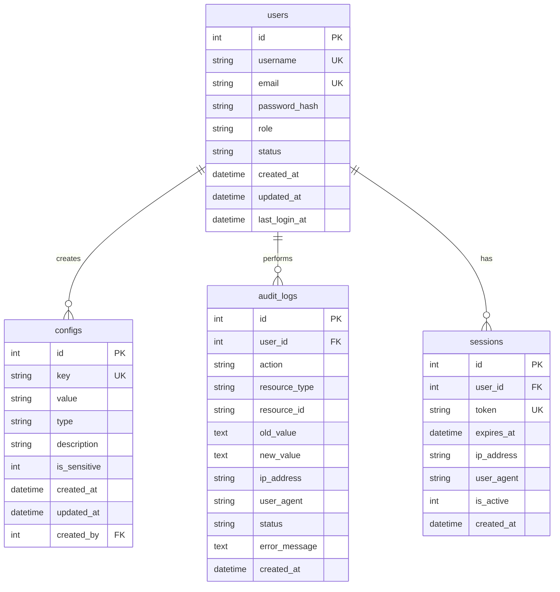

# Database Design Document

**Project:** OpenClaw Dashboard  
**Version:** 1.0  
**Date:** 2026-03-13  
**Status:** Implemented

---

## 1. Overview

This document describes the database design for the OpenClaw Dashboard system. The database layer provides persistent storage for user management, configuration storage, operation auditing, and session tracking.

### 1.1 Design Goals

- **Simplicity**: Easy to understand and maintain
- **Flexibility**: Support both SQLite (development) and PostgreSQL (production)
- **Security**: Proper handling of sensitive data and access control
- **Performance**: Optimized queries with appropriate indexing
- **Auditability**: Complete audit trail of all operations

### 1.2 Database Selection

| Environment | Database | Driver |
|-------------|----------|--------|
| Development | SQLite 3 | better-sqlite3 |
| Production | PostgreSQL 14+ | node-postgres (pg) |

**Rationale:**
- SQLite: Zero configuration, file-based, perfect for development and testing
- PostgreSQL: Production-grade, ACID compliance, advanced features for scale

---

## 2. Entity-Relationship Diagram



---

## 3. Table Schemas

### 3.1 Users Table

Stores user account information.

```sql
CREATE TABLE users (
  id INTEGER PRIMARY KEY AUTOINCREMENT,
  username TEXT UNIQUE NOT NULL,
  email TEXT UNIQUE NOT NULL,
  password_hash TEXT NOT NULL,
  role TEXT DEFAULT 'user' CHECK(role IN ('admin', 'user', 'readonly')),
  status TEXT DEFAULT 'active' CHECK(status IN ('active', 'inactive', 'suspended')),
  created_at DATETIME DEFAULT CURRENT_TIMESTAMP,
  updated_at DATETIME DEFAULT CURRENT_TIMESTAMP,
  last_login_at DATETIME
);
```

**Columns:**

| Column | Type | Constraints | Description |
|--------|------|-------------|-------------|
| id | INTEGER | PRIMARY KEY, AUTOINCREMENT | Unique identifier |
| username | TEXT | UNIQUE, NOT NULL | User's login name |
| email | TEXT | UNIQUE, NOT NULL | User's email address |
| password_hash | TEXT | NOT NULL | Bcrypt password hash |
| role | TEXT | CHECK constraint | User role (admin/user/readonly) |
| status | TEXT | CHECK constraint | Account status |
| created_at | DATETIME | DEFAULT CURRENT_TIMESTAMP | Creation timestamp |
| updated_at | DATETIME | DEFAULT CURRENT_TIMESTAMP | Last update timestamp |
| last_login_at | DATETIME | NULLABLE | Last successful login |

**Indexes:**
- `idx_users_username` - Fast username lookup
- `idx_users_email` - Fast email lookup

---

### 3.2 Configs Table

Stores application configuration key-value pairs.

```sql
CREATE TABLE configs (
  id INTEGER PRIMARY KEY AUTOINCREMENT,
  key TEXT UNIQUE NOT NULL,
  value TEXT NOT NULL,
  type TEXT DEFAULT 'string' CHECK(type IN ('string', 'number', 'boolean', 'json')),
  description TEXT,
  is_sensitive INTEGER DEFAULT 0 CHECK(is_sensitive IN (0, 1)),
  created_at DATETIME DEFAULT CURRENT_TIMESTAMP,
  updated_at DATETIME DEFAULT CURRENT_TIMESTAMP,
  created_by INTEGER,
  FOREIGN KEY (created_by) REFERENCES users(id)
);
```

**Columns:**

| Column | Type | Constraints | Description |
|--------|------|-------------|-------------|
| id | INTEGER | PRIMARY KEY, AUTOINCREMENT | Unique identifier |
| key | TEXT | UNIQUE, NOT NULL | Configuration key |
| value | TEXT | NOT NULL | Configuration value (stored as text) |
| type | TEXT | CHECK constraint | Value type for conversion |
| description | TEXT | NULLABLE | Human-readable description |
| is_sensitive | INTEGER | CHECK constraint | Flag for sensitive data |
| created_at | DATETIME | DEFAULT CURRENT_TIMESTAMP | Creation timestamp |
| updated_at | DATETIME | DEFAULT CURRENT_TIMESTAMP | Last update timestamp |
| created_by | INTEGER | FOREIGN KEY | User who created the config |

**Indexes:**
- `idx_configs_key` - Fast key lookup

---

### 3.3 Audit Logs Table

Records all significant system operations for compliance and debugging.

```sql
CREATE TABLE audit_logs (
  id INTEGER PRIMARY KEY AUTOINCREMENT,
  user_id INTEGER,
  action TEXT NOT NULL,
  resource_type TEXT,
  resource_id TEXT,
  old_value TEXT,
  new_value TEXT,
  ip_address TEXT,
  user_agent TEXT,
  status TEXT DEFAULT 'success' CHECK(status IN ('success', 'failure', 'error')),
  error_message TEXT,
  created_at DATETIME DEFAULT CURRENT_TIMESTAMP,
  FOREIGN KEY (user_id) REFERENCES users(id)
);
```

**Columns:**

| Column | Type | Constraints | Description |
|--------|------|-------------|-------------|
| id | INTEGER | PRIMARY KEY, AUTOINCREMENT | Unique identifier |
| user_id | INTEGER | FOREIGN KEY | User who performed action |
| action | TEXT | NOT NULL | Action type (e.g., CREATE_USER) |
| resource_type | TEXT | NULLABLE | Type of resource affected |
| resource_id | TEXT | NULLABLE | ID of resource affected |
| old_value | TEXT | NULLABLE | Previous value (JSON) |
| new_value | TEXT | NULLABLE | New value (JSON) |
| ip_address | TEXT | NULLABLE | Client IP address |
| user_agent | TEXT | NULLABLE | Client user agent |
| status | TEXT | CHECK constraint | Operation status |
| error_message | TEXT | NULLABLE | Error details if failed |
| created_at | DATETIME | DEFAULT CURRENT_TIMESTAMP | Timestamp |

**Indexes:**
- `idx_audit_logs_user_id` - Filter by user
- `idx_audit_logs_action` - Filter by action type
- `idx_audit_logs_created_at` - Time-based queries

---

### 3.4 Sessions Table

Manages user authentication sessions.

```sql
CREATE TABLE sessions (
  id INTEGER PRIMARY KEY AUTOINCREMENT,
  user_id INTEGER NOT NULL,
  token TEXT UNIQUE NOT NULL,
  expires_at DATETIME NOT NULL,
  ip_address TEXT,
  user_agent TEXT,
  is_active INTEGER DEFAULT 1 CHECK(is_active IN (0, 1)),
  created_at DATETIME DEFAULT CURRENT_TIMESTAMP,
  FOREIGN KEY (user_id) REFERENCES users(id)
);
```

**Columns:**

| Column | Type | Constraints | Description |
|--------|------|-------------|-------------|
| id | INTEGER | PRIMARY KEY, AUTOINCREMENT | Unique identifier |
| user_id | INTEGER | NOT NULL, FOREIGN KEY | Associated user |
| token | TEXT | UNIQUE, NOT NULL | Session token |
| expires_at | DATETIME | NOT NULL | Expiration timestamp |
| ip_address | TEXT | NULLABLE | Client IP address |
| user_agent | TEXT | NULLABLE | Client user agent |
| is_active | INTEGER | CHECK constraint | Active flag |
| created_at | DATETIME | DEFAULT CURRENT_TIMESTAMP | Creation timestamp |

**Indexes:**
- `idx_sessions_user_id` - Find user sessions
- `idx_sessions_token` - Token lookup
- `idx_sessions_expires_at` - Cleanup expired sessions

---

## 4. Data Access Layer (DAL)

### 4.1 Repository Pattern

The system uses the Repository pattern to abstract database operations:

```
┌─────────────────────────────────────┐
│         Application Layer           │
├─────────────────────────────────────┤
│      Repository Interface           │
├─────────────────────────────────────┤
│  UserRepo │ ConfigRepo │ AuditRepo  │
├─────────────────────────────────────┤
│         Database Module             │
│    (Connection & Transaction Mgmt)  │
└─────────────────────────────────────┘
```

### 4.2 Repository Modules

| Repository | File | Operations |
|------------|------|------------|
| UserRepository | `repositories/user-repository.js` | CRUD, search, authentication |
| ConfigRepository | `repositories/config-repository.js` | CRUD, type conversion, bulk ops |
| AuditRepository | `repositories/audit-repository.js` | Create, query, stats, cleanup |
| SessionRepository | `repositories/session-repository.js` | CRUD, validation, cleanup |

### 4.3 Example Usage

```javascript
import { createUser, getUserByUsername } from './repositories/user-repository.js';
import { createAuditLog } from './repositories/audit-repository.js';

// Create user
const user = createUser({
  username: 'john',
  email: 'john@example.com',
  passwordHash: '$2b$10$...',
  role: 'user'
});

// Log the action
createAuditLog({
  userId: user.id,
  action: 'CREATE_USER',
  resourceType: 'user',
  resourceId: String(user.id),
  status: 'success'
});
```

---

## 5. Migrations

### 5.1 Migration System

Database schema changes are managed through versioned migrations:

```
migrations/
├── 001_initial_schema.sql
├── 002_add_indexes.sql
└── ...
```

### 5.2 Migration Commands

```bash
# Check migration status
node scripts/migrate.js status

# Run pending migrations
node scripts/migrate.js up

# Rollback last migration
node scripts/migrate.js down

# Reset database (development only)
node scripts/migrate.js reset --force
```

### 5.3 Current Migrations

| Version | Name | Description |
|---------|------|-------------|
| 1 | initial_schema | Create all tables |
| 2 | add_indexes | Add performance indexes |

---

## 6. Security Considerations

### 6.1 Password Storage

- Passwords are hashed using bcrypt with salt rounds ≥ 10
- Raw passwords are never stored
- Password reset requires email verification

### 6.2 Sensitive Configuration

- Sensitive configs (is_sensitive=1) are excluded from regular queries
- Access to sensitive configs requires admin role
- Values can be encrypted at rest in production

### 6.3 SQL Injection Prevention

- All queries use parameterized statements
- No string concatenation for SQL
- Input validation at repository layer

### 6.4 Audit Logging

- All write operations are logged
- Authentication attempts are logged
- Admin actions are fully audited

---

## 7. Performance Optimization

### 7.1 Indexes

| Table | Index | Purpose |
|-------|-------|---------|
| users | username, email | Fast authentication |
| configs | key | Fast config lookup |
| audit_logs | user_id, action, created_at | Query optimization |
| sessions | token, user_id, expires_at | Session management |

### 7.2 Connection Management

- Singleton database connection pattern
- Connection pooling for PostgreSQL
- WAL mode for SQLite (better concurrency)

### 7.3 Query Optimization

- Pagination for list queries (LIMIT/OFFSET)
- Selective column retrieval
- Prepared statement caching

---

## 8. Backup and Recovery

### 8.1 SQLite Backup

```bash
# Backup database
cp data/openclaw.db data/openclaw.db.backup.$(date +%Y%m%d)

# Restore from backup
cp data/openclaw.db.backup.20260313 data/openclaw.db
```

### 8.2 PostgreSQL Backup

```bash
# Backup
pg_dump openclaw_dashboard > backup.sql

# Restore
psql openclaw_dashboard < backup.sql
```

### 8.3 Retention Policy

- Audit logs: 90 days (configurable)
- Expired sessions: Auto-cleanup daily
- Config history: Keep all versions

---

## 9. Testing

### 9.1 Test Database

- Uses in-memory SQLite for unit tests
- Separate file database for integration tests
- Auto-cleanup after test suite

### 9.2 Test Coverage

Target: >80% coverage

```bash
# Run tests
npm test

# Run with coverage
npm run test:coverage
```

### 9.3 Test Categories

1. **Schema Tests**: Verify table structure
2. **Repository Tests**: CRUD operations
3. **Integration Tests**: End-to-end workflows
4. **Migration Tests**: Schema evolution

---

## 10. Future Enhancements

### 10.1 Planned Improvements

- [ ] Soft delete support for all tables
- [ ] Config versioning/history
- [ ] Full-text search for audit logs
- [ ] Partitioning for audit_logs (large datasets)
- [ ] Read replicas for production

### 10.2 PostgreSQL Migration

When migrating to PostgreSQL:

1. Update connection string in environment
2. Replace better-sqlite3 with node-postgres
3. Adjust data types (INTEGER → SERIAL, DATETIME → TIMESTAMP)
4. Update migration scripts for PostgreSQL syntax

---

## 11. Appendix

### 11.1 Environment Variables

| Variable | Description | Default |
|----------|-------------|---------|
| DB_PATH | SQLite database path | `./data/openclaw.db` |
| DB_HOST | PostgreSQL host | `localhost` |
| DB_PORT | PostgreSQL port | `5432` |
| DB_NAME | Database name | `openclaw_dashboard` |
| DB_USER | Database user | `openclaw` |
| DB_PASSWORD | Database password | - |
| DB_VERBOSE | Enable SQL logging | `false` |

### 11.2 File Structure

```
backend/
├── src/
│   ├── database/
│   │   ├── index.js          # Connection management
│   │   ├── schema.js         # Schema definitions
│   │   └── migrations.js     # Migration system
│   └── repositories/
│       ├── user-repository.js
│       ├── config-repository.js
│       ├── audit-repository.js
│       └── session-repository.js
├── scripts/
│   ├── init-db.js            # Database initialization
│   └── migrate.js            # Migration CLI
├── tests/
│   └── database.test.js      # Unit tests
└── data/
    └── openclaw.db           # SQLite database file
```

---

**Document History:**

| Version | Date | Author | Changes |
|---------|------|--------|---------|
| 1.0 | 2026-03-13 | Dashboard Team | Initial version |
